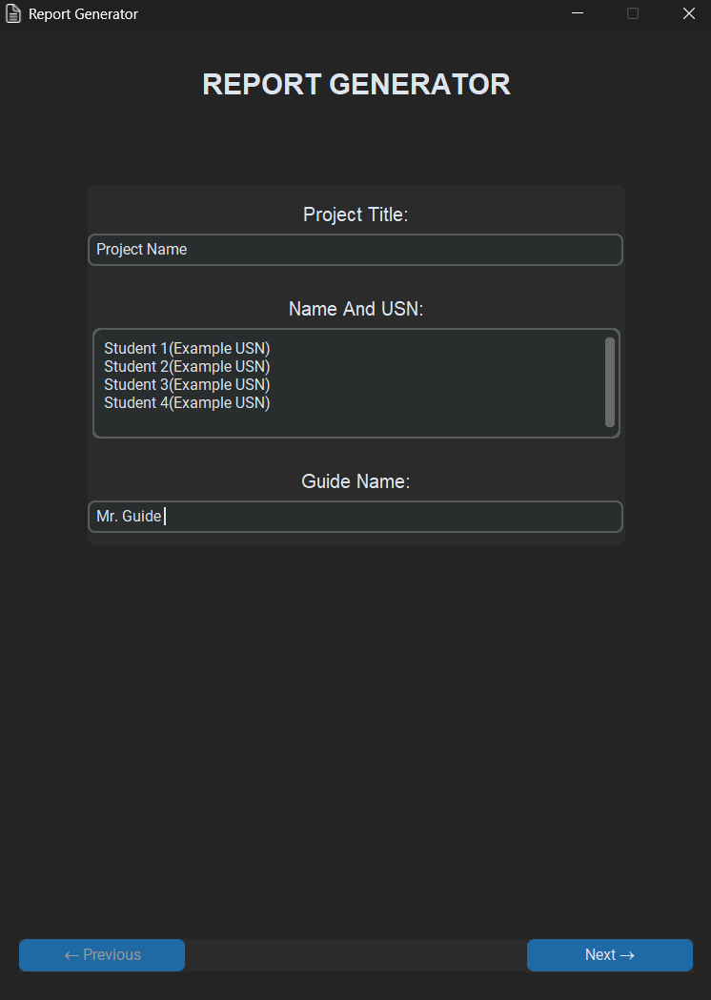
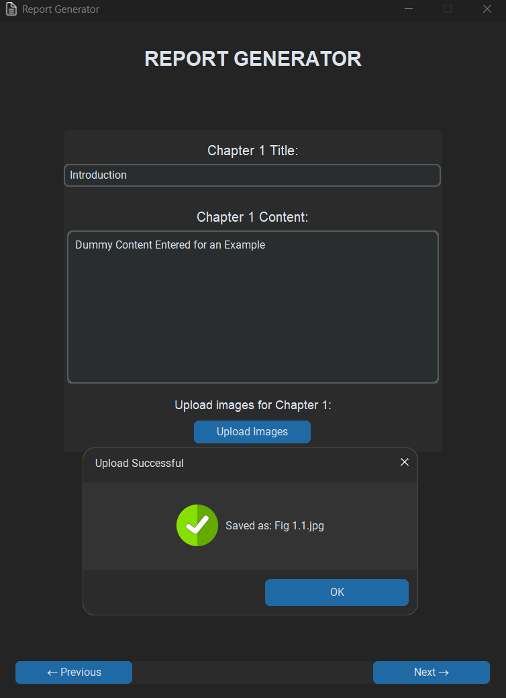
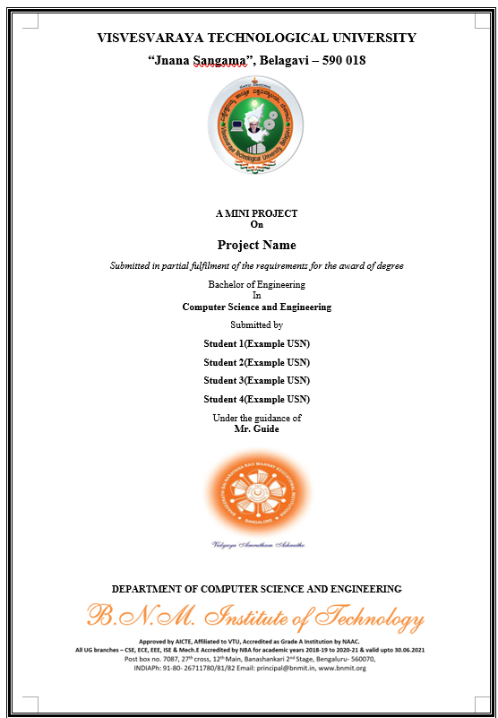

# Automated Report Generator


An intuitive desktop application that automates the creation of technical project reports. This tool provides a user-friendly interface to input report data and dynamically generates a professionally formatted Microsoft Word document, saving you hours of tedious formatting work.

---

### ✨ Key Features

* **Intuitive GUI:** A clean and modern user interface built with CustomTkinter.
* **Step-by-Step Wizard:** A multi-page layout that guides you through each section of the report.
* **Dynamic Document Generation:** Automatically populates a Microsoft Word template with your data.
* **Image Support:** Easily upload and embed images directly into your chapters.
* **Automatic Formatting:** Handles page numbers, headers, footers, table of contents, and more.
* **Side-by-Side Preview:** Positions the app and the Word document for easy viewing as you work.

---

### 📸 Screenshots


| Page 1: Project Details | Page 4: Chapter Content | Final Report |
| :---------------------- | :---------------------- | :----------- |
|  |  |  |

---

### 🛠️ Technology Stack
Primarily built with Python 3.8+, this project leverages several libraries and tools to create a seamless experience:
* **GUI:** Python with the [CustomTkinter](https://github.com/TomSchimansky/CustomTkinter) library.
* **Document Automation:** [pywin32](https://pypi.org/project/pypiwin32/) to interact with the Microsoft Word COM API.
* **File Handling:** Uses standard Python libraries for file operations.
* **Version Control:** Managed with Git and hosted on GitHub.
* **Platform:** Designed to run on Windows with Microsoft Word installed.

---

### 🚀 Getting Started

Follow these instructions to get the Report Generator running on your local machine (Windows).

#### Prerequisites

You must have the following software installed:

1.  **Python:** Version 3.8 or newer. You can download it from [python.org](https://www.python.org/downloads/).
2.  **Microsoft Word:** A desktop version of Microsoft Word must be installed on your Windows machine.

#### Installation Instructions

1.  **Get the Code:**
    * **Option A: Clone the Repository:**
        * Go to the GitHub repository page: [https://github.com/TechIT-Community/Report-Generator/](https://github.com/TechIT-Community/Report-Generator/)
        * Click the green `<> Code` button.
        * `📋`Copy the URL provided under the `Clone` section below `HTTPS`.
        * Open a terminal or command prompt.
        * Navigate to the directory where you want to clone the project (e.g., your Desktop).
        * Run the following command:
            ```bash
            git clone <copied URL>
            ```
        * Replace `<copied URL>` with the URL you copied from GitHub.
        * Navigate into the cloned directory:
            ```bash
            cd Report-Generator/app/v1/
            ```
    * **Option B: Download as ZIP:**
        * Go to the GitHub repository page: [https://github.com/TechIT-Community/Report-Generator/](https://github.com/TechIT-Community/Report-Generator/)
        * Click the green `<> Code` button.
        * Click `Download ZIP`.
        * Extract the downloaded ZIP file to a location of your choice (e.g., your Desktop).
        * After extraction, navigate into the extracted folder. 
            - Either open the folder in an IDE &nbsp;&nbsp; *(OR)* 
            - Enter "cmd" into the address bar of the File Explorer and press Enter to open a command prompt in that directory(inside app/v1/).

2.  **Verify Project Structure:**
    After extracting, your project folder should already have the necessary files and folders. It will look like this:

    ```bash
    Report-Generator/app/v1/
    ├── assets/
    │   ├── BNMIT_Logo.png
    │   ├── BNMIT_Text.png
    │   ├── icon.ico
    │   └── VTU_Logo.png
    ├── reports/
    ├── screenshots/
    ├── Document_Generator.py   #Driver code
    ├── Main.py                 #Frontend GUI
    ├── README.md
    └── requirements.txt
    ```

3.  **Set Up Environment and Install Dependencies:**
    * Open a terminal or command prompt and navigate to the project directory.
        ```bash
        cd <save location>
        ```
        Replace `<save location>` with the path where you cloned or extracted the project.
        Usually `cd Desktop/Report-Generator/app/v1/` if you cloned it to your Desktop.
    * It is highly recommended to use a Python virtual environment (`venv`) to keep project dependencies isolated.

    * **Option A: Use a Virtual Environment (Recommended)**
        * Create the virtual environment by running the following command in your terminal in the project directory:
            <a id="venv-setup"></a>
            ```bash
            python -m venv venv
            ```
        * Activate it:
            ```bash
            # On Windows
            .\venv\Scripts\activate
            ```
        * Install the required libraries:
            ```bash
            pip install -r requirements.txt
            ```

    * **Option B: Install Globally**
        * If you prefer not to use a virtual environment, you can install the packages directly by running the following command in your terminal in the project directory:
            ```bash
            pip install -r requirements.txt
            ```

---

### ▶️ How to Run the Application

Once the installation is complete, you can run the application with a single command:

1.  Make sure you are still in the project directory in your terminal. (If you used a venv, [ensure it is active](#venv-setup)).
2.  Run the `Main.py` script:
    ```bash
    python Main.py
    ```
3.  The application window and a new Microsoft Word document should appear on your screen.
4.  Follow the these instructions to fill in your project details, chapters, and images.
    -   Please ensure that Microsoft Word is closed before running the application to avoid any conflicts.
    -   Please wait for the Word document to open completely and render a template before interacting with the application.
    -   Enter your project details in the first page.
    -   Click `Next` to navigate through the pages.
    -   Click `Previous` to go back if needed.
    -   Use the `Add Image` button to upload images for each chapter.
    -   Click `Done` to Generate your final document.
5.  After you click `Done`, the application will automatically generate a Microsoft Word document with your report, including all the chapters and images you provided. The generated report will be saved in the `reports/` folder 
6.  You can open the generated report in Microsoft Word to review and make any final adjustments as needed.

---

### 🏗️ How It Works

The project is built with a clean separation of concerns:

* **`Main.py` (The Frontend):** This script handles the entire user interface. It creates the windows, fields, and buttons. When you click "Next", it saves your input and sends it to the backend.
* **`Document_Generator.py` (The Backend):** This script is the engine. It uses the `pywin32` library to control Microsoft Word. It first creates a template with static text and placeholders (called "bookmarks"). When it receives data from the frontend, it finds the corresponding bookmarks and fills them with your text and images.

---

### 🤝 Contributing

Contributions are what make the open-source community such an amazing place to learn, inspire, and create. Any contributions you make are **greatly appreciated**. If you find this project helpful, another great way to show your support is by giving it a star on GitHub! ⭐

If you have a suggestion that would make this better, please fork the repo and create a pull request. You can also simply open an issue with the tag "enhancement".


1.  Fork the Project
2.  Create your Feature Branch (`git checkout -b feature/AmazingFeature`)
3.  Commit your Changes (`git commit -m 'Add some AmazingFeature'`)
4.  Push to the Branch (`git push origin feature/AmazingFeature`)
5.  Open a Pull Request

---

### 📞 Contact

TechIT-Community, BNMIT <br> 
Bengaluru, India

Project Link: [https://github.com/TechIT-Community/Report-Generator/](https://github.com/TechIT-Community/Report-Generator/)
